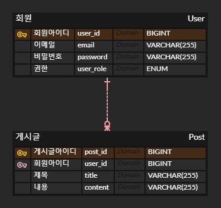

# wanted-pre-onboarding-backend

# 8월 11일까지 완료하겠습니다.

## 과제 주소
원티드 : https://www.wanted.co.kr/events/pre_ob_be_6  
깃허브 : https://github.com/lordmyshepherd-edu/wanted-pre-onboardung-backend-selection-assignment

## 목차
1. [AWS배포](#aws-배포)
2. [테스트 작성](#테스트)
3. [지원자 성명](#지원자-성명)
4. [애플리케이션의 실행 방법](#애플리케이션의-실행-방법)
5. [구현한 API의 동작을 촬영한 데모 영상 링크](#구현한-api의-동작을-촬영한-데모-영상-링크)
6. [구현 방법 및 이유에 대한 간략한 설명](#구현-방법-및-이유에-대한-간략한-설명)
7. [API 명세](#api-명세)

## AWS 배포

[AWS EC2 배포 주소](http://15.165.44.35:8082/posts)  
[Swagger 주소](http://15.165.44.35:8082/swagger-ui/index.html#/)

### 개발환경

Java · Spring Boot · Spring Data JPA · Querydsl · MySQL · Spring Security · Docker · AWS EC2 · Gradle

## 테스트
**컨트롤러** : @SpringBootTest 
**서비스** : @ExtendWith

테스트코드를 작성하여 아래와같은 장점을 얻었습니다.

1. 코드가 변경되어도 예상치 못한 부작용을 방지
2. 작성한 코드가 의도한 대로 작동하는지 검증하여 실제 애플리케이션을 띄우지 않고 코드 검증
3. 배포시 버그를 최소화

## 지원자 성명
김솔배 

## 애플리케이션의 실행 방법

1. git clone https://github.com/ReadnThink/wanted-pre-onboarding-backend.git
2. application.yml 파일에 환경변수 입력
  3. mysql의 URL, USERNAME, PASSWORD
  4. jwt.secret에 jwt 생성을 위한 키값 입력
5. yml에 입력한 mysql에 스키마를 추가
6. Java IDE를 사용해 애플리케이션을 실행

### 엔드포인트 호출

위 설명대로 진행되었다는 가정하에 시작합니다.

1. 애플리케이션을 실행
2. API를 테스트 할 수 있는 플랫폼을 이용해 API를 호출
3. API 명세는 [WIKI페이지](https://github.com/ReadnThink/wanted-pre-onboarding-backend/wiki/API-%EB%AA%85%EC%84%B8(request-response-%ED%8F%AC%ED%95%A8))를 참고해 주세요.

## 데이터베이스 테이블 구조

## 구현한 API의 동작을 촬영한 데모 영상 링크

회원가입 

### 성공

https://github.com/ReadnThink/wanted-pre-onboarding-backend/assets/103480627/929dab4c-43a7-4434-8e35-98c0af1af2c1

### 실패

https://github.com/ReadnThink/wanted-pre-onboarding-backend/assets/103480627/f0acf9e3-b2c5-45bb-89cb-f5d4cd1543a4

https://github.com/ReadnThink/wanted-pre-onboarding-backend/assets/103480627/a121bfc6-074f-4e3a-9cc1-b12d4e8c6866

로그인 

### 성공

https://github.com/ReadnThink/wanted-pre-onboarding-backend/assets/103480627/221c03f4-c882-4230-86b8-b68d62b7ad5b

### 실패

https://github.com/ReadnThink/wanted-pre-onboarding-backend/assets/103480627/ecd2875d-d7c0-4f0e-a336-498181005bef

게시글 리스트 조회 

  
### 성공
  
https://github.com/ReadnThink/wanted-pre-onboarding-backend/assets/103480627/a2352005-37dc-41fa-b3de-852505aca01f

게시글 한건 조회 

  
### 성공
  
https://github.com/ReadnThink/wanted-pre-onboarding-backend/assets/103480627/dcc02796-d32a-4f9b-9549-66e70583e7de

### 실패

https://github.com/ReadnThink/wanted-pre-onboarding-backend/assets/103480627/ce237e69-c334-411a-8b40-537b3e238455

게시글 작성 

  
### 성공
  
https://github.com/ReadnThink/wanted-pre-onboarding-backend/assets/103480627/e717753b-9f99-4e0d-946a-44b7e9ce8eaf

### 실패

https://github.com/ReadnThink/wanted-pre-onboarding-backend/assets/103480627/b53b3246-b434-4be7-9bf2-4b3c354352d6

게시글 수정 

  
### 성공
  
https://github.com/ReadnThink/wanted-pre-onboarding-backend/assets/103480627/159e8864-2eee-4c9e-a1ac-f40fa4d641d1

### 실패

https://github.com/ReadnThink/wanted-pre-onboarding-backend/assets/103480627/53ff0fb8-87fe-40ab-a0e6-56a441be7a83

https://github.com/ReadnThink/wanted-pre-onboarding-backend/assets/103480627/0b8ed51b-39fe-40a9-8a42-dae0d9a3a988

게시글 삭제 

  
### 성공
  
https://github.com/ReadnThink/wanted-pre-onboarding-backend/assets/103480627/85426801-f8cb-4be9-9ada-b5e9443b2c18

### 실패

https://github.com/ReadnThink/wanted-pre-onboarding-backend/assets/103480627/0046615d-2e61-48a2-8e76-bc3b0af9fe11

https://github.com/ReadnThink/wanted-pre-onboarding-backend/assets/103480627/7e613fe0-0682-4881-ab55-729bbe1efe8d

## 구현 방법 및 이유에 대한 간략한 설명

[WIKI페이지](https://github.com/ReadnThink/wanted-pre-onboarding-backend/wiki/%EA%B5%AC%ED%98%84-%EB%B0%A9%EB%B2%95-%EB%B0%8F-%EC%9D%B4%EC%9C%A0%EC%97%90-%EB%8C%80%ED%95%9C-%EA%B0%84%EB%9E%B5%ED%95%9C-%EC%84%A4%EB%AA%85)를 참고해 주세요.

## API 명세

[WIKI페이지](https://github.com/ReadnThink/wanted-pre-onboarding-backend/wiki/API-%EB%AA%85%EC%84%B8(request-response-%ED%8F%AC%ED%95%A8))를 참고해 주세요.
